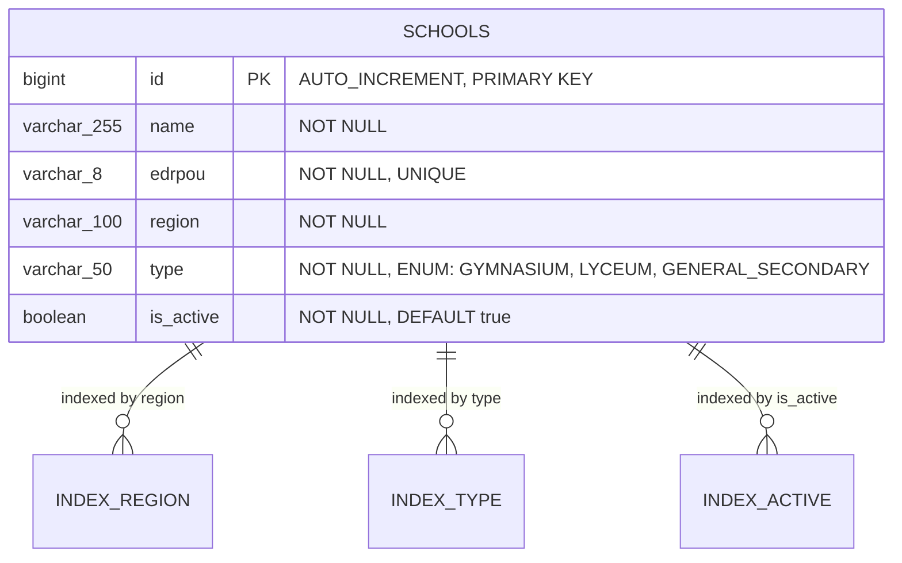

# ERD Схема бази даних - Реєстр шкільних закладів

## Діаграма сутність-зв'язок (Entity-Relationship Diagram)



## Опис таблиці SCHOOLS

| Поле | Тип | Обмеження | Опис |
|------|-----|-----------|------|
| `id` | BIGINT | PRIMARY KEY, AUTO_INCREMENT | Унікальний ідентифікатор закладу |
| `name` | VARCHAR(255) | NOT NULL | Назва навчального закладу |
| `edrpou` | VARCHAR(8) | NOT NULL, UNIQUE | Код ЄДРПОУ (8 цифр) |
| `region` | VARCHAR(100) | NOT NULL | Область України |
| `type` | VARCHAR(50) | NOT NULL | Тип закладу (enum) |
| `is_active` | BOOLEAN | NOT NULL, DEFAULT true | Статус активності |

## Індекси

- **idx_schools_region** - індекс по полю `region` для швидкого пошуку по областях
- **idx_schools_type** - індекс по полю `type` для швидкого пошуку по типу закладу
- **idx_schools_is_active** - індекс по полю `is_active` для швидкого фільтрування активних/неактивних закладів

## Енум-значення

### SchoolType
- `GYMNASIUM` - Гімназія
- `LYCEUM` - Ліцей
- `GENERAL_SECONDARY` - ЗЗСО (Заклад загальної середньої освіти)

## Бізнес-правила

1. **Soft Delete**: Система не видаляє записи фізично, а лише деактивує їх через поле `is_active`
2. **Унікальність ЄДРПОУ**: Кожен заклад має унікальний код ЄДРПОУ
3. **Валідація ЄДРПОУ**: Код повинен містити рівно 8 цифр
4. **Обов'язкові поля**: Всі поля, крім `id`, є обов'язковими для заповнення
5. **Типи закладів**: Підтримуються лише три типи навчальних закладів

## SQL для створення таблиці

```sql
CREATE TABLE schools (
    id BIGINT AUTO_INCREMENT PRIMARY KEY,
    name VARCHAR(255) NOT NULL,
    edrpou VARCHAR(8) NOT NULL UNIQUE,
    region VARCHAR(100) NOT NULL,
    type VARCHAR(50) NOT NULL,
    is_active BOOLEAN NOT NULL DEFAULT true
);

-- Створення індексів
CREATE INDEX idx_schools_region ON schools(region);
CREATE INDEX idx_schools_type ON schools(type);
CREATE INDEX idx_schools_is_active ON schools(is_active);
``` 